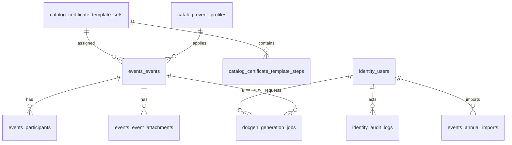

# Schéma PostgreSQL — architecture multi-services

Chaque microservice possède un **schéma PostgreSQL dédié** dans une instance unique (VPS). Voir [ADR-008](../docs/decisions/008-microservices-modular-architecture.md).

## Répartition par schéma

| Schéma | Service | Tables |
|--------|---------|--------|
| `identity` | identity-service | `users`, `audit_logs` |
| `catalog` | catalog-service | `package_templates`, `certificate_template_sets`, `certificate_template_steps`, `event_profiles`, `system_settings` |
| `events` | events-service | `annual_imports`, `events`, `participants`, `event_attachments` |
| `docgen` | docgen-service | `generation_jobs` |

## Relations cross-schéma

```
identity.users ←── events.annual_imports.imported_by_id
identity.users ←── docgen.generation_jobs.requested_by_id
catalog.certificate_template_sets ←── events.events.certificate_set_id
catalog.event_profiles ←── events.events.event_profile_id
events.events ←── docgen.generation_jobs.event_id
```

Ces FK restent dans la même instance PostgreSQL. Pour un futur split multi-DB, remplacer par des UUID stockés sans contrainte FK + validation via API.

## Diagramme ER



## Fichiers

| Fichier | Rôle |
|---------|------|
| `schema.sql` | Init Docker (`docker-entrypoint-initdb.d`) |
| `migrations/` | Évolutions futures par service (Alembic) |

## Ajouter un schéma pour un nouveau module

```sql
CREATE SCHEMA IF NOT EXISTS guides;
CREATE TABLE guides.procedures ( ... );
```

Puis enregistrer le service dans Docker Compose et Nginx.
