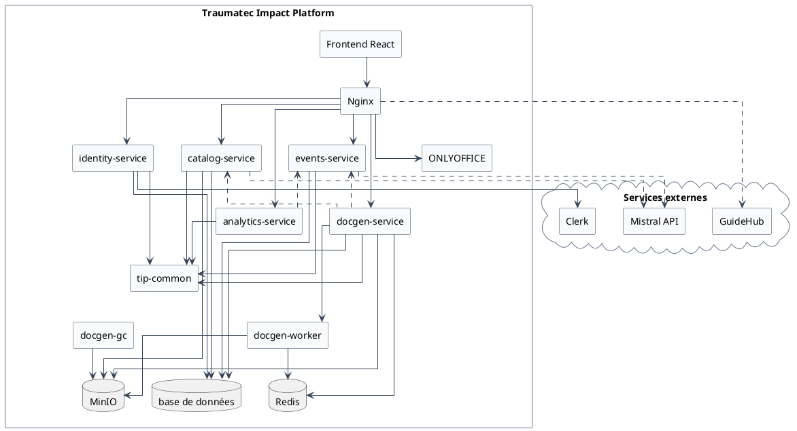
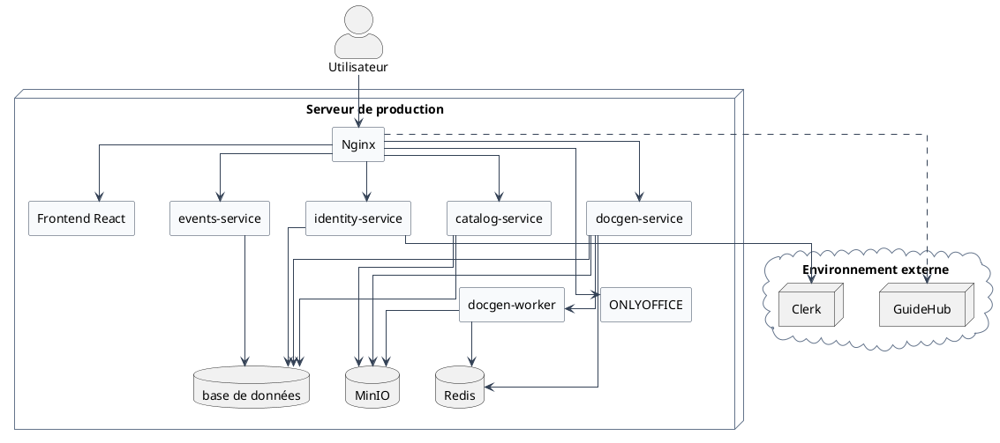
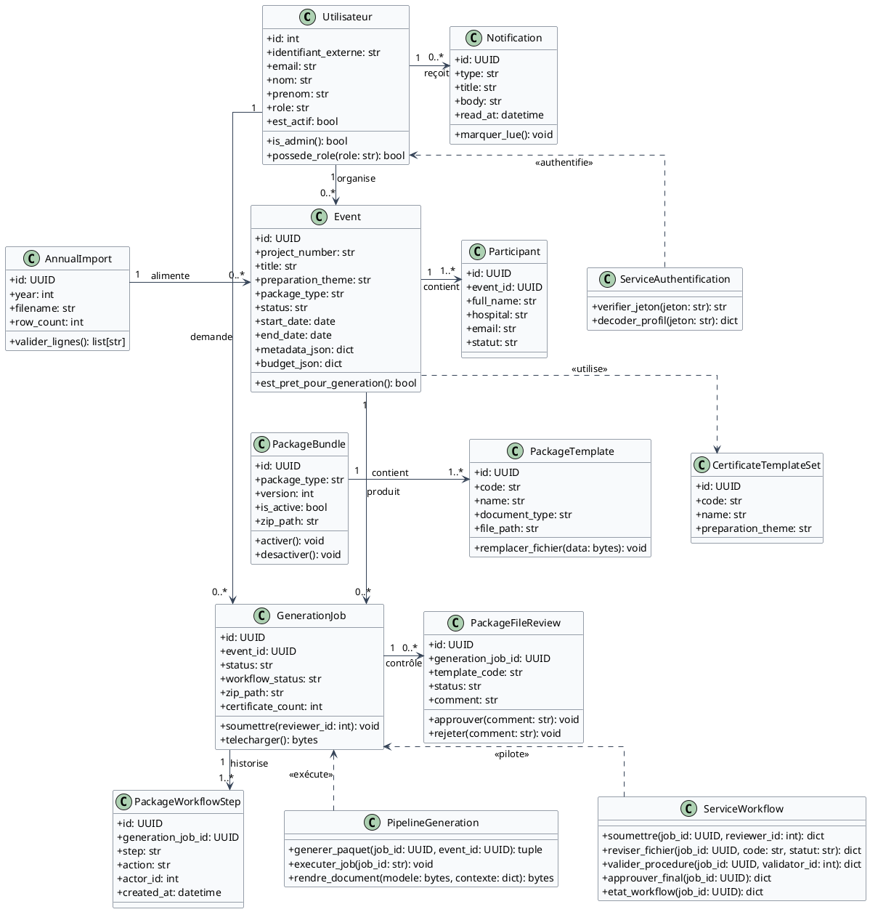
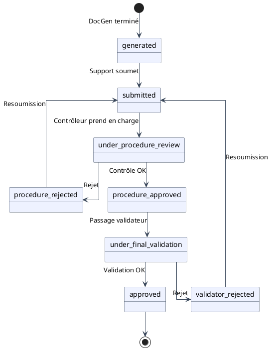

# CAHIER DE CONCEPTION

**Projet :** Traumatec Impact Platform (TIP) — AO Alliance / TRAUMATEC  
**Livrable :** L-03 Cahier de conception  
**Version :** 1.0 — juillet 2026  
**Production :** https://tip-platform.hopto.org

**Rédigé par :**
- BILOGUE SEME Eric Kevin
- NGANOMO Aimé

**Sous la coordination de :** M. NKOA Dominique

**Documents amont :** [L-01 Cahier des charges](CAHIER_DES_CHARGES.md) · [L-02 Cahier d'analyse](CAHIER_D_ANALYSE.md)

---

## Table des matières

1. [Introduction](#1-introduction)
2. [Présentation du projet](#2-présentation-du-projet)
3. [Documents de référence](#3-documents-de-référence)
4. [Normes, standards et outils](#4-normes-standards-et-outils)
5. [Conception générale](#5-conception-générale)
6. [Conception détaillée](#6-conception-détaillée)
7. [Conclusion](#7-conclusion)

---

## 1. Introduction

Le [cahier d'analyse](CAHIER_D_ANALYSE.md) a modélisé les besoins, acteurs et interactions de **Traumatec Impact Platform (TIP)** : vingt-cinq besoins fonctionnels, dix exigences non fonctionnelles, cas d'utilisation, modèle de classes d'analyse et diagrammes de séquence système. Le présent **cahier de conception** traduit cette analyse en **architecture technique** et en **choix d'implémentation** prêts pour la phase de développement et de déploiement.

TIP est une application web destinée à automatiser la production des paquets documentaires des événements de formation AO Alliance / TRAUMATEC : accords, programmes, budgets, émargements et certificats, avec un circuit qualité intégré (contrôle procédure, validation finale).

**Objectif du document :** décrire comment le système sera structuré et réalisé — modules logiciels, interfaces externes, contraintes, normes, diagrammes de composants et de déploiement, classes de conception, algorithmes principaux, charte graphique et maquettes des écrans.

**Plan annoncé :**
- la présentation du projet (objectifs, interfaces système, contraintes) ;
- les documents de référence et les normes/outils retenus ;
- la conception générale (modules, composants, déploiement) ;
- la conception détaillée (classes, algorithmes, thème, maquettes) ;
- une conclusion annonçant la phase d'implémentation.

Les diagrammes UML sont rédigés en PlantUML (`docs/diagrams/conception/`) avec **lignes orthogonales** (segments droits, sans courbes) et exportés en PNG.

---

## 2. Présentation du projet

### 2.1. Objectifs du système

Les objectifs ci-dessous sont alignés sur le [cahier des charges](CAHIER_DES_CHARGES.md) et confirmés par l'implémentation déployée (juillet 2026).

| Objectif | Description | Critère de réussite |
|----------|-------------|---------------------|
| **Automatisation documentaire** | Produire un ZIP complet (accord, programme, budget, certificats…) à partir de modèles et de données saisies une seule fois | Génération asynchrone < 15 s pour un paquet standard |
| **Pilotage des événements** | Importer le plan annuel Excel, gérer fiches événement, participants et référentiels | Import en masse avec rapport d'erreurs par ligne |
| **Conformité AO Alliance** | Respecter les modèles de préparation, le nommage ZIP et les règles certificats (2 passes) | Convention `[Projet]_[Événement]_[Ville]_[Pays]_[Date].zip` |
| **Circuit qualité intégré** | Soumission, contrôle fichier par fichier, validation finale, traçabilité | États workflow persistés et notifiés in-app |
| **Administration maîtrisée** | Templates versionnés, catalogue types/catégories, utilisateurs multi-rôles, audit | RBAC 4 rôles + journal d'audit exportable |
| **Interopérabilité** | Pont SSO GuideHub, édition ONLYOFFICE, auth Clerk | Handoff JWT à usage unique (TTL 120 s) |
| **Exploitabilité** | Déploiement reproductible, observabilité, données souveraines | Docker Compose identique dev/prod sur EC2 |

### 2.2. Interfaces du système

> Il s'agit des **interfaces logicielles** par lesquelles TIP interagit avec son environnement extérieur — et non des interfaces graphiques utilisateur (voir § 6.4).

| Interface | Type | Protocole | Rôle |
|-----------|------|-----------|------|
| **Clerk** | Authentification SaaS | OAuth 2.0 / OpenID Connect, JWT RS256, JWKS | Connexion, invitations, vérification des jetons côté backend |
| **GuideHub** | Application procédures (Next.js) | HTTP proxy Nginx `/gh/*`, JWT bridge + ticket Redis | SSO sans double saisie de mot de passe |
| **ONLYOFFICE Document Server** | Édition collaborative | HTTP (config WOPI-like) | Édition des templates Word/Excel et prévisualisation workflow |
| **Mistral API** | Intelligence artificielle | REST HTTPS | Assistant commandes, scan variables à l'import ZIP |
| **NVIDIA NIM** (optionnel) | Classification événement | REST HTTPS | Inférence type de paquet / thème de préparation |
| **MinIO** | Stockage objet | API S3 | Templates, ZIP générés, pièces jointes, exports audit |
| **PostgreSQL** | Base relationnelle | SQL (async SQLAlchemy) | Persistance métier (schémas identity, events, catalog, docgen) |
| **Redis** | Cache / file de messages | Protocole Redis | File RQ DocGen, tickets handoff GuideHub |
| **Navigateur client** | Frontend SPA | HTTPS REST `/api/v1/*` | Consommation API via passerelle Nginx |
| **Courriel (mailto)** | Sortie vers responsable national | URI `mailto:` préremplie | Remise du dossier validé (acteur externe sans compte TIP) |

**Contrat API interne :** le frontend n'appelle jamais directement les ports 8001–8005 en production. Nginx route les préfixes `/api/v1/*` vers le microservice concerné (identity, events, catalog, docgen, analytics).

### 2.3. Contraintes générales de conception

| Contrainte | Impact sur la conception |
|------------|--------------------------|
| **RGPD** | Données personnelles (participants, enseignants) hébergées sur infrastructure maîtrisée (EC2) ; auth déléguée Clerk ; pas d'inscription publique ; journal d'audit |
| **Application fermée** | Pas de portail d'inscription ; invitations administrateur uniquement |
| **Normes documentaires AO Alliance** | Modèles Word/Excel imposés ; pipeline DocGen respecte l'arborescence et le nommage ZIP |
| **Ressources serveur limitées** | EC2 2 vCPU / 4 Go RAM → jobs longs hors requête HTTP (Redis/RQ), stockage fichiers sur MinIO |
| **Bilinguisme FR/EN** | Interface i18n (`translations.ts`) pour les utilisateurs internationaux |
| **Compatibilité navigateurs** | Chrome, Firefox, Edge, Safari (n-2) |
| **Traçabilité qualité** | Historique workflow (`package_workflow_steps`) et revue par fichier (`package_file_reviews`) |
| **Évolutivité** | Microservices modulaires (ADR-008) ; schéma PostgreSQL par domaine |
| **Contexte académique ISI** | Livrables documentaires structurés, méthode SCRUM, encadrement double (académique + PO) |

---

## 3. Documents de référence

| Code | Document | Fichier | Rôle |
|------|----------|---------|------|
| L-01 | Cahier des charges | [CAHIER_DES_CHARGES.md](CAHIER_DES_CHARGES.md) | Besoins fonctionnels et non fonctionnels, périmètre |
| L-02 | Cahier d'analyse | [CAHIER_D_ANALYSE.md](CAHIER_D_ANALYSE.md) | UML analyse : cas d'utilisation, classes, séquences système |
| L-03 | Cahier de conception | **Ce document** | Architecture, conception détaillée, maquettes |
| L-04 | Schéma BDD | `database/schema.sql` + `database/migrations/` | Modèle relationnel |
| — | Architecture (synthèse) | [architecture.md](architecture.md) | Vue rapide microservices |
| — | RBAC & workflow | [REFACTOR_RBAC_WORKFLOW.md](REFACTOR_RBAC_WORKFLOW.md) | Spécification workflow qualité |
| — | Parcours d'import | [import-templates-flow.md](import-templates-flow.md) | Import templates et plan annuel |
| — | Décisions d'architecture | [decisions/](decisions/) | ADR-001 à ADR-010 |
| — | Diagrammes UML | [diagrams/](diagrams/) | Sources PlantUML et exports PNG |

---

## 4. Normes, standards et outils

### 4.1. Méthodes de conception

| Élément | Choix retenu | Justification |
|---------|--------------|---------------|
| **Démarche** | **SCRUM** (4 sprints d'une semaine) | Projet académique ISI avec livraisons incrémentales ; adaptation rapide aux retours du PO (workflow qualité, RBAC, GuideHub) |
| **Langage de modélisation** | **UML 2.x** (PlantUML) | Cas d'utilisation, classes, objets, séquences, composants, déploiement, machine d'états — outil textuel versionnable dans Git |
| **Architecture** | C4 (contexte, conteneurs) + microservices | Séparation claire des responsabilités ; ADR documentés |

Les diagrammes d'**analyse** (boîte noire, sans types ni méthodes) figurent dans le [cahier d'analyse](CAHIER_D_ANALYSE.md). Les diagrammes de **conception** (types, signatures, composants techniques) figurent dans ce document.

### 4.2. Environnement et outils de développement

#### 4.2.1. Matériels et outils

| Domaine | Technologie | Version / rôle |
|---------|-------------|----------------|
| **Frontend** | React, TypeScript, Vite, Tailwind CSS, TailAdmin | React 19, Vite 6, Tailwind 4 |
| **Backend** | FastAPI, Pydantic, SQLAlchemy async | Python 3.11+ |
| **Architecture** | Microservices modulaires | identity, events, catalog, docgen, analytics |
| **Bibliothèque partagée** | `tip-common` | Auth Clerk, rôles RBAC, storage S3, contrats inter-services |
| **Base de données** | PostgreSQL | 16 — schémas par service |
| **File de tâches** | Redis + RQ | Jobs DocGen asynchrones |
| **Stockage fichiers** | MinIO (API S3) | Templates, ZIP, audit exports |
| **Auth** | Clerk | JWT/JWKS, invitations |
| **Édition documents** | ONLYOFFICE Document Server | 8.0.1 |
| **Moteur DocGen** | docxtpl, openpyxl, python-docx | Injection templates Office |
| **Passerelle** | Nginx | TLS, reverse proxy, routage API |
| **Conteneurisation** | Docker Compose | Dev local + prod EC2 |
| **Observabilité** | Prometheus, Grafana | Métriques services |
| **IA** | Mistral API, NVIDIA NIM (optionnel) | Assistant, classification |
| **Versionnement** | Git / GitHub | Branche `staging` |
| **IDE** | Visual Studio Code / Cursor | Développement |

**Infrastructure production :** AWS EC2 Ubuntu 24.04 (`tip-platform.hopto.org`), UFW (22, 80, 443, 3101), Let's Encrypt.

#### 4.2.2. Standard de programmation

| Pratique | Application TIP |
|----------|-----------------|
| **Typage strict** | TypeScript côté frontend ; Pydantic v2 côté backend |
| **API contractuelle** | OpenAPI auto-généré (`/api/v1/docs` par service) |
| **Nommage** | Python snake_case ; TypeScript camelCase ; routes REST kebab-case |
| **Séparation des couches** | `features/` frontend par domaine ; routers FastAPI par ressource |
| **Auth centralisée** | `tip_common.security` — dépendances `require_can_*` |
| **Pas de secrets en dur** | Variables d'environnement (`.env`, compose) |
| **Migrations BDD** | Fichiers SQL incrémentaux `database/migrations/` |
| **Commits** | Messages descriptifs ; revue par l'équipe (2 développeurs) |
| **i18n** | Clés FR/EN dans `translations.ts` — pas de chaînes en dur dans les composants |

### 4.3. Plan de qualité

Dans ce projet, le plan de qualité s'appuie sur les processus de la norme **ISO/IEC 12207** (cycle de vie logiciel) et se décline ainsi :

| Processus | Référence | Application TIP |
|-----------|-----------|-----------------|
| **Assurance Qualité Logicielle (AQL)** | IEEE 730 | Revue des livrables documentaires (L-01 à L-03) ; validation PO |
| **Vérification et Validation (V&V)** | IEEE 1059 | Tests manuels par sprint ; recette métier sur EC2 ; critères BF/BNF du cahier des charges |
| **Revue et audits** | IEEE 1028 | Revue de code entre développeurs ; démos de fin de sprint |
| **Gestion des configurations** | ISO 12207 | Git, branches, migrations versionnées, bundles templates versionnés |
| **Gestion des risques** | ISO 27005 | Auth Clerk, HTTPS, RBAC, audit, stockage maîtrisé, pas d'exposition MinIO |

---

## 5. Conception générale

### 5.1. Identification et description des modules

| Module | Service / couche | Responsabilités principales |
|--------|-------------------|----------------------------|
| **M1 — Authentification & identité** | `identity-service` (:8001) | Sync utilisateurs Clerk, multi-rôles, invitations, audit, notifications, pont GuideHub |
| **M2 — Événements** | `events-service` (:8002) | CRUD événements, import plan annuel Excel, participants, enseignants, contacts nationaux, assistant IA |
| **M3 — Catalogue documentaire** | `catalog-service` (:8003) | Templates, bundles ZIP versionnés, catégories/types de paquet, jeux certificats, profils événement, ONLYOFFICE |
| **M4 — Génération documentaire** | `docgen-service` (:8004) + `docgen-worker` | Jobs génération asynchrone, pipeline DocGen, workflow qualité, certificats, garbage collector stockage |
| **M5 — Analytics** | `analytics-service` (:8005) | Prédictions et corrélations (admin, hors flux principal) |
| **M6 — Interface utilisateur** | `frontend/` (React) | SPA : dashboards par rôle, événements, documents, workflow, administration |
| **M7 — Passerelle API** | Nginx | TLS, routage `/api/v1/*`, proxy Clerk/GuideHub/ONLYOFFICE, service fichiers statiques |
| **M8 — Bibliothèque partagée** | `packages/tip-common` | Auth, rôles, storage MinIO, analyse ZIP, factory FastAPI, contrats Pydantic |

**Principes structurants :**
- un point d'entrée HTTP (Nginx) ;
- un schéma PostgreSQL par microservice ;
- fichiers hors base (MinIO) ;
- jobs longs dans Redis/RQ (`docgen-worker`).

### 5.2. Diagramme de composants



*Source PlantUML : `docs/diagrams/conception/components.puml`*

Le diagramme montre la couche présentation (React), la passerelle Nginx, les cinq microservices FastAPI, les workers asynchrones, la bibliothèque `tip-common`, les bases de données (PostgreSQL, Redis, MinIO), ONLYOFFICE et les services externes (Clerk, GuideHub, Mistral).

### 5.3. Diagramme de déploiement



*Source PlantUML : `docs/diagrams/conception/deployment.puml`*

| Environnement | URL | Fichiers Compose |
|---------------|-----|------------------|
| Développement local | http://localhost:8080 | `docker-compose.yml` |
| Production | https://tip-platform.hopto.org | `docker-compose.yml` + `docker-compose.prod.yml` |

**Volumes persistants :** `pgdata` (PostgreSQL), `minio_data` (documents), `certbot/conf` (TLS).  
**Script de déploiement :** `scripts/deploy-ec2.sh` — répertoire serveur `/opt/traumatec-impact-platform`.

---

## 6. Conception détaillée

### 6.1. Diagramme de classes de conception

Contrairement au [diagramme de classes d'analyse](CAHIER_D_ANALYSE.md#42-diagramme-de-classes), ce diagramme précise les **types des attributs** et les **signatures des méthodes** principales.



*Source PlantUML : `docs/diagrams/conception/class-design.puml`*

**Classes centrales :**

| Classe | Rôle |
|--------|------|
| `Utilisateur` | Compte local synchronisé avec Clerk ; rôles RBAC |
| `Event` | Fiche événement (métadonnées, budget, thème, type paquet) |
| `Participant` | Ligne importée pour certificats et émargement |
| `PackageBundle` / `PackageTemplate` | Modèles documentaires versionnés |
| `GenerationJob` | Job DocGen + état workflow |
| `PackageFileReview` | Revue fichier par fichier (contrôle / validation) |
| `DocGenPipeline` | Orchestration génération ZIP |
| `PackageWorkflowService` | Transitions d'état workflow |
| `ClerkTokenVerifier` | Vérification JWT côté backend |

### 6.2. Algorithmes

#### 6.2.1. Authentification (Clerk)

```
ENTRÉE : requête HTTP avec en-tête Authorization Bearer JWT
1. Extraire le jeton JWT de l'en-tête
2. Vérifier la signature RS256 via JWKS Clerk (ClerkTokenVerifier.verify)
3. Extraire clerk_id et email du payload
4. Résoudre l'utilisateur local (clerk_id → email exact → email flou → API Clerk)
5. Charger les rôles depuis identity.user_roles
6. Retourner AuthenticatedUser ou rejeter 401/403
SORTIE : profil utilisateur + rôles pour le frontend et les garde-fous API
```

#### 6.2.2. Import du plan annuel (Excel)

```
ENTRÉE : fichier Projects.xlsx ou tip-import-evenements.xlsx
1. Créer un ImportJob asynchrone (status=running)
2. Parser le classeur (openpyxl) avec mapping colonnes HEADER_ALIASES
3. Normaliser dates, montants, inférer preparation_theme par ligne
4. Valider chaque ligne ; collecter erreurs par numéro de ligne
5. Si valide : remplacer les événements existants (stratégie destructive)
6. Insérer par lots de 100 ; lier organizer_responsible_user_id par email
7. Enregistrer AnnualImport + rapport (row_count, error_report)
SORTIE : rapport succès/erreurs affiché à l'administrateur
```

#### 6.2.3. Génération du paquet documentaire (DocGen)

```
ENTRÉE : event_id, options de génération, utilisateur authentifié
1. Vérifier prérequis : événement complet, ≥1 participant, bundle actif
2. Créer GenerationJob (status=queued) ; enqueue run_docgen_job sur Redis/RQ
3. Worker — charger événement, participants, templates actifs (HTTP interne)
4. Construire contexte Jinja2 (build_event_context)
5. Pour chaque template : télécharger MinIO → render_package_document (docxtpl/openpyxl)
6. Pipeline certificats : étape 1 (socle événement) puis étape 2 (boucle participants)
7. Assembler README.txt + manifest ; compresser ZIP convention AO Alliance
8. Upload MinIO ; MAJ job (status=completed, workflow_status=generated)
SORTIE : ZIP téléchargeable ; en cas d'échec status=failed + message explicite
```

#### 6.2.4. Workflow qualité



*Source PlantUML : `docs/diagrams/conception/workflow-states.puml`*

```
ÉTATS : generated → submitted → under_procedure_review
        → procedure_approved | procedure_rejected
        → under_final_validation → approved | validator_rejected

ALGORITHME soumission :
  SI workflow_status ∈ {generated, procedure_rejected, validator_rejected}
    ET status du job = completed
    ALORS assigner contrôleur ; workflow_status ← submitted ; notifier

ALGORITHME contrôle procédure :
  POUR CHAQUE fichier du paquet :
    enregistrer PackageFileReview (approved | rejected + commentaire)
  SI tous approuvés → procedure_approved → under_final_validation
  SINON → procedure_rejected ; notifier support

ALGORITHME validation finale :
  Même revue par le validateur
  SI approuvé → approved ; proposer mailto responsable national
  SINON → validator_rejected ; notifier support (resoumission possible)
```

### 6.3. Thème de l'application

Le thème visuel est basé sur le template **TailAdmin**, adapté à l'identité Traumatec / AO Alliance. Il est conservé pour toutes les maquettes et interfaces.

#### Logo

| Variante | Fichier |
|----------|---------|
| Logo principal (clair) | `frontend/public/images/logo/logo.svg` |
| Logo sombre | `frontend/public/images/logo/logo-dark.svg` |
| Icône | `frontend/public/images/logo/logo-icon.svg` |
| Logo animé (écran auth) | `frontend/src/components/brand/TipAnimatedLogo.tsx` |

#### Principales couleurs

| Token | Hex | Usage |
|-------|-----|-------|
| **brand-500** (primaire) | `#465FFF` | Boutons primaires, liens actifs, accents sidebar |
| **brand-600** | `#3641F5` | Hover boutons primaires |
| **brand-50** | `#ECF3FF` | Fonds icônes KPI, badges légers |
| **gray-900** | `#101828` | Texte principal |
| **gray-500** | `#667085` | Texte secondaire |
| **success** | palette Tailwind `success-*` | Statuts approuvés, génération terminée |
| **warning** | palette `warning-*` | En attente, en cours |
| **error** | palette `error-*` | Rejets, échecs |

**Modes :** clair par défaut ; mode sombre via `ThemeToggleButton` (classes `dark:` Tailwind).

#### Composants UI

| Composant | Style |
|-----------|-------|
| **Bouton primaire** | `bg-brand-500 text-white rounded-lg shadow-theme-xs hover:bg-brand-600` |
| **Bouton outline** | Bordure `gray-300`, fond transparent |
| **Champs texte** | `rounded-lg border-gray-300 focus:ring-brand-500/10 focus:border-brand-300` |
| **Listes déroulantes** | `Select`, `MultiSelect` — focus ring brand |
| **Cases à cocher** | Composants formulaire TailAdmin, accent brand |
| **Tableaux** | `DataTable` + `DataTablePagination` — lignes hover `gray-50` |
| **Badges statut** | Couleur selon `workflowStatusVisual.ts` / `projectStatus.ts` |
| **Sidebar** | Fond blanc/sombre, item actif `brand-500`, menu filtré par rôle |

### 6.4. Maquettes des principales interfaces

Les maquettes ci-dessous décrivent la structure des écrans livrés. L'application de production est accessible sur https://tip-platform.hopto.org.

#### Écran 1 — Connexion (`/`)

- Logo TIP animé centré
- Widget Clerk (email / OAuth Google)
- Fond dégradé neutre ; carte blanche arrondie

#### Écran 2 — Tableau de bord (`/dashboard`)

| Zone | Contenu |
|------|---------|
| En-tête | Salutation, rôle, recherche globale Ctrl+K |
| Cartes KPI | Selon rôle : événements, paquets, files workflow |
| Panneau activité | Générations et soumissions récentes |
| Sidebar | Menu filtré (`buildNavItems.tsx` / `navByRole.ts`) |

#### Écran 3 — Liste événements (`/evenements`)

- Actions : importer plan, télécharger modèle Excel, créer événement
- Filtres : type, pays, période, statut, recherche
- Tableau paginé : titre, dates, pays, statut, type paquet

#### Écran 4 — Fiche événement (`/evenements/:id`)

- Métadonnées, budget, thème, type paquet inféré
- Référentiels : responsable national, enseignants
- Pièces jointes (images programme, signatures)
- Liens : modifier, participants, génération

#### Écran 5 — Certificats (`/certificats`)

- Sélecteur d'événement ; import Excel participants
- Statistiques participants / certificats générés
- Prévisualisation ONLYOFFICE

#### Écran 6 — Templates (`/documents/templates`)

- Onglets par catégorie (Cours, Séminaire, Faculty, custom)
- Chips types de paquet ; table versions ZIP
- Panneau ONLYOFFICE + variables détectées

#### Écran 7 — Génération (`/documents/generation/:eventId`)

- Indicateurs de prérequis (participants, bundle actif)
- Bouton « Générer le paquet » ; barre de progression job
- Workflow : soumettre au contrôle, choix contrôleur
- Historique des versions générées

#### Écran 8 — Contrôle procédure (`/workflow/controle/:jobId`)

- En-tête événement ; liste fichiers du paquet
- Revue : statut pending/approved/rejected + commentaire
- Prévisualisation ONLYOFFICE ; bouton « Terminer le contrôle »

#### Écran 9 — Validation finale (`/workflow/validation/:jobId`)

- Même structure que contrôle ; actions approuver/rejeter
- Lien mailto responsable national après approbation

#### Écran 10 — Administration

| Page | Route | Contenu |
|------|-------|---------|
| Utilisateurs | `/admin/utilisateurs` | Tableau, invitation Clerk, multi-rôles |
| Types de paquets | `/admin/referentiels/types-paquets` | CRUD catégories et types |
| Audit | `/admin/audit` | Journal actions, export |
| Stockage | `/admin/stockage` | Rétention, purge, graphiques |
| GuideHub | `/admin/guidehub` | Configuration pont SSO |

---

## 7. Conclusion

Ce cahier de conception a traduit l'analyse fonctionnelle de TIP en une **architecture microservices** opérationnelle : cinq services FastAPI, une bibliothèque partagée `tip-common`, une passerelle Nginx, PostgreSQL multi-schéma, Redis/RQ pour la génération asynchrone, MinIO pour les documents, et des intégrations Clerk, ONLYOFFICE et GuideHub.

Les livrables de conception comprennent :
- l'identification de huit modules logiciels ;
- les diagrammes de **composants** et de **déploiement** (PlantUML, lignes orthogonales) ;
- le diagramme de **classes de conception** avec types et méthodes ;
- les algorithmes des flux critiques (auth, import, DocGen, workflow) ;
- la charte graphique (logo, couleurs `#465FFF`, composants UI) ;
- les maquettes des dix écrans principaux.

La phase suivante est l'**implémentation continue et la maintenance** du code sur la branche `staging`, avec compléments identifiés : UI admin jeux certificats, tests e2e workflow, synchronisation `schema.sql` avec les migrations RBAC. L'application est déjà déployée en production sur https://tip-platform.hopto.org et sert de référence pour la recette métier et la soutenance.

---

## Signatures

| Qualité / Rôle | Nom | Date |
|----------------|-----|------|
| Auteur (Étudiant) | BILOGUE SEME Eric Kevin | Juillet 2026 |
| Auteur | NGANOMO Aimé | Juillet 2026 |
| Product Owner / Encadrant Pro | M. NKOA Dominique | Juillet 2026 |
| Encadrant Académique | Saint-Jean Ingénieur | Juillet 2026 |
