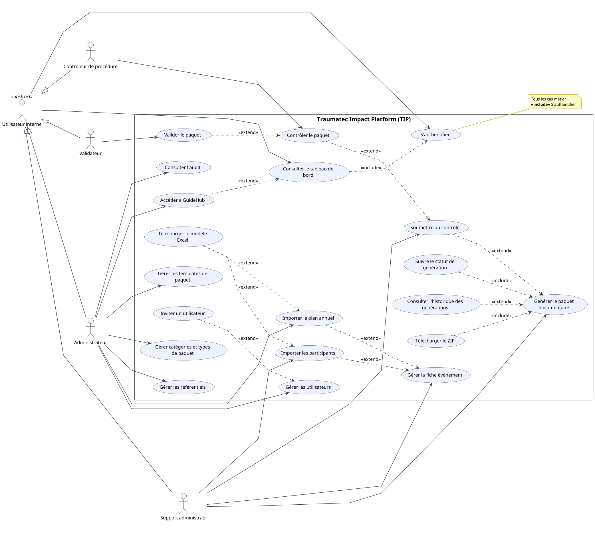
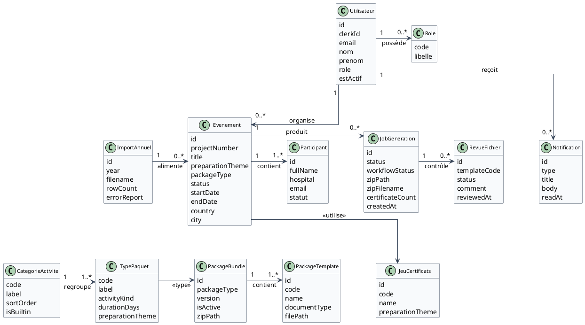
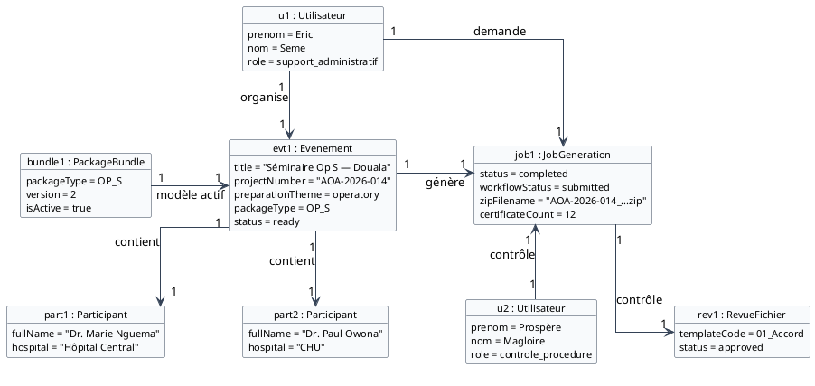
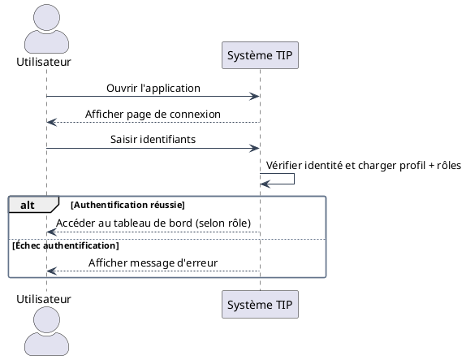
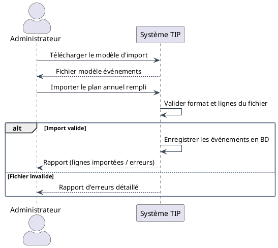
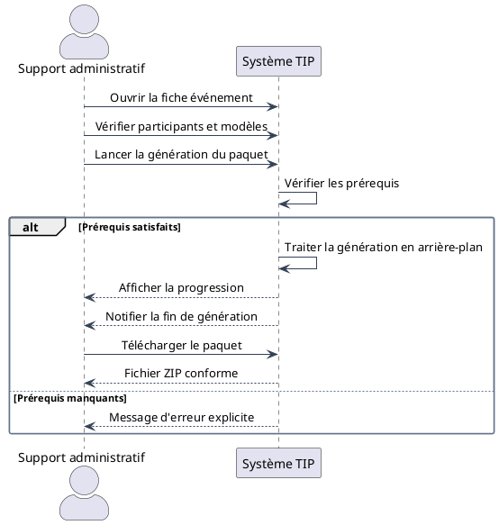
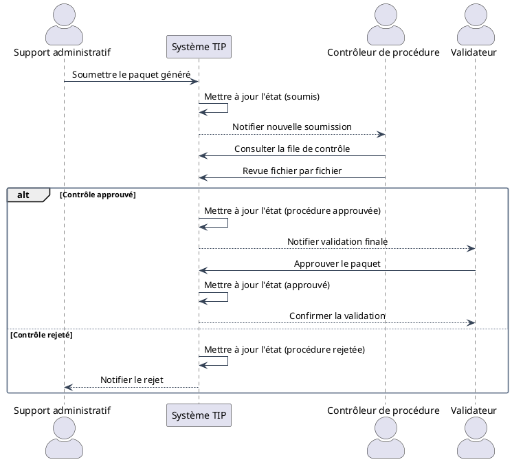
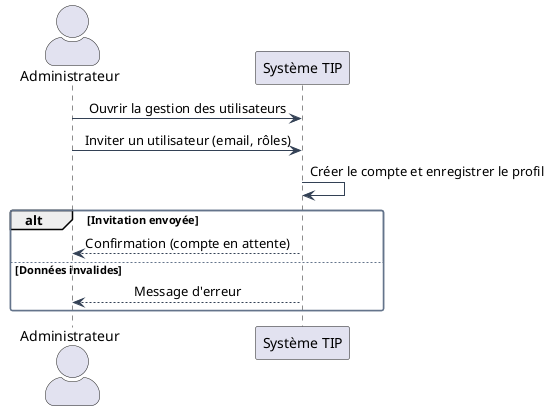

# CAHIER D'ANALYSE

**Cas d'étude :** AO Alliance / TRAUMATEC  
**Application :** Traumatec Impact Platform (TIP)

**Rédigé par :**
- BILOGUE SEME Eric Kevin
- NGANOMO Aimé

**Sous la coordination de :** M. NKOA Dominique

**Version :** 1.0 — juillet 2026  
**Document amont :** [Cahier des charges](CAHIER_DES_CHARGES.md) (L-01)  
**Document suivant :** [Cahier de conception](CAHIER_DE_CONCEPTION.md) (L-03)

---

## Table des matières

1. [Introduction](#1-introduction)
2. [Présentation du projet](#2-présentation-du-projet)
3. [Cas d'utilisation du système](#3-cas-dutilisation-du-système)
4. [Diagrammes de classes](#4-diagrammes-de-classes)
5. [Diagrammes de séquence système](#5-diagrammes-de-séquence-système)
6. [Conclusion](#6-conclusion)

---

## 1. Introduction

La médecine d'urgence et la traumatologie exigent des formations continues dont l'organisation administrative est lourde : accords, programmes, budgets, émargements et certificats doivent être produits pour chaque événement, souvent en ressaisissant les mêmes informations dans de nombreux fichiers Word et Excel.

Le projet **Traumatec Impact Platform (TIP)** vise à automatiser cette production documentaire pour AO Alliance et TRAUMATEC. Le [cahier des charges](CAHIER_DES_CHARGES.md) a fixé le périmètre métier et les objectifs du produit. Le présent **cahier d'analyse** modélise le système du point de vue des besoins, des acteurs et des interactions, avant toute décision d'architecture détaillée.

**Objectif du document :** identifier les besoins fonctionnels et non fonctionnels, les acteurs, les cas d'utilisation et les entités métier, à l'aide de diagrammes UML (cas d'utilisation, classes, objets, séquences système).

**Plan annoncé :**
- la présentation du projet et de son contexte ;
- l'analyse des besoins et des acteurs ;
- les diagrammes de cas d'utilisation et leurs descriptions textuelles ;
- le modèle de classes d'analyse et un diagramme d'objets ;
- les diagrammes de séquence système des cas principaux ;
- une conclusion annonçant le [cahier de conception](CAHIER_DE_CONCEPTION.md).

Les diagrammes sont rédigés en PlantUML (`docs/diagrams/analyse/`) avec **lignes orthogonales** (segments droits, sans courbes — voir `docs/diagrams/_common.puml`) et exportés en images PNG.

---

## 2. Présentation du projet

### 2.1. Présentation générale du projet

TIP est une application web qui permet à TRAUMATEC de :

- **piloter** les événements de formation (cours, séminaires, faculty) ;
- **importer** le plan annuel et les listes de participants ;
- **générer automatiquement** les paquets documentaires (accord, programme, budget, certificats…) à partir de modèles ;
- **faire circuler** les paquets dans un circuit qualité interne (contrôle procédure, validation finale) ;
- **administrer** les modèles, les types de paquet, les utilisateurs et la traçabilité.

Les grandes attentes du commanditaire AO Alliance sont : **gain de temps**, **saisie unique**, **conformité aux modèles**, **nommage homogène des ZIP** et **traçabilité** des générations et validations.

Le produit s'appuie sur trois piliers :

| Pilier | Idée générale |
|--------|----------------|
| Gestion des événements | Import Excel, fiche unique, participants, référentiels |
| Automatisation documentaire | Injection dans templates, certificats par participant, ZIP |
| Administration et qualité | Templates, rôles, audit, workflow de contrôle et validation |

### 2.2. Contexte du projet

#### Contexte académique

Projet réalisé en **quatrième année** à l'Institut Saint-Jean (ISI), année 2025–2026, dans le cadre du travail de fin de cycle. Méthode **SCRUM** sur quatre sprints d'une semaine, avec livrables : cahier des charges, cahier d'analyse, cahier de conception, code source et soutenance.

Encadrement : encadrant académique (méthode et qualité documentaire) et encadrant professionnel **M. NKOA Dominique** (Product Owner, validation métier).

#### Contexte sociétal

Dans les pays à ressources limitées, la formation des soignants en traumatologie est stratégique. La lourdeur administrative ne doit pas détourner les équipes de l'activité clinique et pédagogique. TIP répond à un besoin de **dématérialisation maîtrisée** et de **standardisation** des dossiers transmis aux financeurs.

#### Contexte technologique

Les organisations adoptent des solutions web hébergées sur infrastructure maîtrisée (VPS/EC2), avec base relationnelle, stockage objet et authentification déléguée. La génération de documents Office à partir de modèles est une problématique mature (`docxtpl`, files d'attente asynchrones). TIP s'inscrit dans cette tendance avec **PostgreSQL**, **Redis**, **MinIO**, **Clerk** et une architecture **microservices** conteneurisée (**Docker Compose**).

---

## 3. Cas d'utilisation du système

### 3.1. Les besoins

#### 3.1.1. Besoins fonctionnels

| ID | Besoin fonctionnel | Priorité |
|----|-------------------|----------|
| BF-01 | Connexion sécurisée (Clerk, invitations admin) | Critique |
| BF-02 | Import annuel du plan (Excel / Projects.xlsx) | Critique |
| BF-03 | Tableau de bord par rôle avec indicateurs | Critique |
| BF-04 | Consultation et édition de la fiche événement | Critique |
| BF-05 | Association thème de préparation et type de paquet | Critique |
| BF-06 | Gestion des templates de paquet (ZIP versionnés) | Critique |
| BF-07 | Pipeline certificats en deux étapes (événement + participant) | Critique |
| BF-08 | Formulaire unique : métadonnées, budget, contexte | Critique |
| BF-09 | Import en masse des participants (Excel) | Élevée |
| BF-10 | Téléversement des visuels (signatures, programme, photo) | Critique |
| BF-11 | Options de génération (sources, fusion certificats) | Élevée |
| BF-12 | Génération asynchrone du paquet | Critique |
| BF-13 | Suivi du statut de génération | Critique |
| BF-14 | Téléchargement sécurisé du ZIP | Critique |
| BF-15 | Nommage automatique du ZIP (convention AO Alliance) | Critique |
| BF-16 | Historique des générations par événement | Élevée |
| BF-17 | Administration catégories et types de paquet | Élevée |
| BF-18 | Gestion des comptes et rôles (multi-rôles) | Critique |
| BF-19 | Journal d'audit | Moyenne |
| BF-20 | README automatique dans le ZIP | Élevée |
| BF-21 | Workflow soumission → contrôle → validation | Critique |
| BF-22 | Notifications in-app sur le workflow | Élevée |
| BF-23 | Référentiels responsables nationaux et enseignants | Élevée |
| BF-24 | Modèles Excel téléchargeables (événements, participants) | Élevée |
| BF-25 | Pont SSO vers GuideHub (procédures) | Moyenne |

#### 3.1.2. Besoins non fonctionnels

| ID | Catégorie | Exigence |
|----|-----------|----------|
| BNF-01 | Ergonomie | Interface intuitive pour non-techniciens (FR/EN) |
| BNF-02 | Performance | Génération paquet standard < 15 s côté worker |
| BNF-03 | Performance | Chargement tableau de bord < 2 s |
| BNF-04 | Sécurité | HTTPS, JWT Clerk, RBAC par rôles |
| BNF-05 | Robustesse | Jobs DocGen asynchrones (Redis/RQ) |
| BNF-06 | Traçabilité | Historique générations, workflow, audit |
| BNF-07 | Évolutivité | Microservices modulaires |
| BNF-08 | Maintenabilité | API typée, OpenAPI par service |
| BNF-09 | Portabilité | Docker Compose dev/prod identique |
| BNF-10 | Compatibilité | Navigateurs modernes (Chrome, Firefox, Edge, Safari) |

### 3.2. Les acteurs et leurs rôles

#### 3.2.1. Acteurs internes

Acteurs appartenant à TRAUMATEC / AO Alliance et disposant d'un compte TIP :

| Acteur | Rôle applicatif | Rôle métier |
|--------|-----------------|-------------|
| **Support administratif** | `support_administratif` | Prépare événements, importe participants, génère et soumet les paquets |
| **Contrôleur de procédure** | `controle_procedure` | Contrôle chaque fichier du paquet, approuve ou rejette |
| **Validateur** | `validateur` | Validation finale, remise au responsable national |
| **Administrateur** | `administrateur` | Templates, utilisateurs, import annuel, audit, paramétrage |

Un même utilisateur peut cumuler plusieurs rôles.

#### 3.2.2. Acteurs externes

| Acteur | Interaction |
|--------|-------------|
| **Responsable national** | Destinataire du dossier validé (email / mailto) — **pas de compte TIP** |
| **AO Alliance** | Commanditaire, normes documentaires |
| **Clerk** | Fournisseur d'authentification (SaaS) |
| **GuideHub** | Application procédures (Next.js séparée), accès via handoff SSO |

### 3.3. Diagramme des cas d'utilisation

*Source PlantUML : `docs/diagrams/analyse/use-case.puml`*

Le diagramme regroupe tous les cas dans le périmètre **Traumatec Impact Platform (TIP)**. L'acteur abstrait **Utilisateur interne** est spécialisé par héritage en quatre rôles. **S'authentifier** est au centre du diagramme : chaque cas métier le **inclut** (`<<include>>`). Les relations `<<extend>>` modélisent les dépendances optionnelles (imports, workflow qualité).

### 3.4. Description textuelle des cas d'utilisation

#### CU-00 — S'authentifier

| Élément | Description |
|---------|-------------|
| **Intitulé** | S'authentifier |
| **Objectif** | Accéder de manière sécurisée à TIP et obtenir un profil avec rôles |
| **Acteurs** | Support administratif, Contrôleur de procédure, Validateur, Administrateur |
| **Préconditions** | Compte invité par un administrateur ; application accessible (HTTPS) |
| **Postcondition** | Session Clerk active ; profil utilisateur et rôles chargés ; redirection vers le tableau de bord |
| **Scénario principal** | 1. L'utilisateur ouvre TIP. 2. Il se connecte via Clerk (email ou OAuth). 3. Le système vérifie le jeton JWT et synchronise le profil local. 4. L'interface s'adapte aux rôles de l'utilisateur. |
| **Scénario alternatif** | Jeton invalide ou compte désactivé : accès refusé avec message explicite. |

#### CU-01 — Générer le paquet documentaire

| Élément | Description |
|---------|-------------|
| **Intitulé** | Générer le paquet documentaire |
| **Objectif** | Produire automatiquement le ZIP complet d'un événement |
| **Acteurs** | Support administratif, Administrateur |
| **Préconditions** | Utilisateur connecté ; événement renseigné ; participants importés ; bundle template actif pour le type de paquet |
| **Postcondition** | Job de génération terminé ; ZIP disponible au téléchargement ; état workflow = `generated` |
| **Scénario principal** | 1. L'utilisateur ouvre la page génération de l'événement. 2. Il vérifie les prérequis affichés. 3. Il clique sur « Générer le paquet ». 4. Le système crée un job asynchrone. 5. Le worker injecte les données dans les templates et produit les certificats. 6. Le système assemble le ZIP et l'enregistre. 7. L'utilisateur est notifié de la fin et peut télécharger le fichier. |
| **Scénario alternatif** | Prérequis manquants (aucun participant, pas de template actif) : le système refuse le lancement et affiche un message explicite. Échec worker : statut `failed` et message d'erreur dans le journal du job. |

#### CU-02 — Soumettre au contrôle procédure

| Élément | Description |
|---------|-------------|
| **Intitulé** | Soumettre le paquet au contrôle procédure |
| **Objectif** | Transmettre un paquet généré au circuit qualité interne |
| **Acteurs** | Support administratif |
| **Préconditions** | Paquet généré (`workflow_status = generated`) ; contrôleur sélectionné |
| **Postcondition** | État `submitted` ; notification au contrôleur |
| **Scénario principal** | 1. Le support ouvre le détail de génération. 2. Il choisit un contrôleur de procédure. 3. Il confirme la soumission. 4. Le système met à jour l'état et notifie le contrôleur. |
| **Scénario alternatif** | Paquet déjà soumis ou état incompatible : le système refuse et indique l'état actuel. |

#### CU-03 — Contrôler le paquet (fichier par fichier)

| Élément | Description |
|---------|-------------|
| **Intitulé** | Contrôler le paquet |
| **Objectif** | Vérifier la conformité de chaque document du paquet |
| **Acteurs** | Contrôleur de procédure |
| **Préconditions** | Paquet assigné ou en file de contrôle |
| **Postcondition** | Tous les fichiers revus ; état `procedure_approved` ou `procedure_rejected` |
| **Scénario principal** | 1. Le contrôleur ouvre la file `/workflow/controle`. 2. Il sélectionne un paquet. 3. Pour chaque fichier, il consulte la prévisualisation et marque approuvé ou rejeté avec commentaire. 4. Il termine le contrôle. 5. Le système notifie le validateur ou le support selon le résultat. |
| **Scénario alternatif** | Rejet : commentaire obligatoire ; le support peut corriger et resoumettre. |

#### CU-04 — Valider le paquet

| Élément | Description |
|---------|-------------|
| **Intitulé** | Valider le paquet en validation finale |
| **Objectif** | Approuver définitivement le dossier avant remise au responsable national |
| **Acteurs** | Validateur |
| **Préconditions** | État `under_final_validation` |
| **Postcondition** | État `approved` ; dossier prêt pour remise au responsable national (hors TIP) |
| **Scénario principal** | 1. Le validateur consulte la file de validation. 2. Il examine le paquet et l'historique de contrôle. 3. Il approuve. 4. Le système enregistre la décision finale. |
| **Scénario alternatif** | Rejet avec commentaire → état `validator_rejected` ; notification au support. |

#### CU-05 — Importer le plan annuel

| Élément | Description |
|---------|-------------|
| **Intitulé** | Importer le plan annuel |
| **Objectif** | Créer en masse les événements depuis Excel |
| **Acteurs** | Administrateur |
| **Préconditions** | Utilisateur administrateur connecté |
| **Postcondition** | Événements créés ou mis à jour ; rapport d'import |
| **Scénario principal** | 1. L'admin télécharge le modèle TIP. 2. Il remplit le fichier. 3. Il l'importe depuis la page Événements. 4. Le système valide et enregistre les lignes. 5. Un rapport indique succès et erreurs par ligne. |
| **Scénario alternatif** | Format invalide ou colonnes manquantes : import refusé avec détail des erreurs. |

#### CU-06 — Créer / inviter un utilisateur

| Élément | Description |
|---------|-------------|
| **Intitulé** | Inviter un utilisateur |
| **Objectif** | Ajouter un compte avec rôles dans TIP |
| **Acteurs** | Administrateur |
| **Préconditions** | Administrateur connecté |
| **Postcondition** | Invitation Clerk envoyée ; profil local créé |
| **Scénario principal** | 1. L'admin ouvre `/admin/utilisateurs`. 2. Il clique sur inviter. 3. Il saisit email, nom et rôles. 4. Le système envoie l'invitation Clerk et enregistre l'utilisateur. |
| **Scénario alternatif** | Email déjà utilisé ou erreur Clerk : message d'erreur affiché. |

#### CU-07 — Gérer les templates de paquet

| Élément | Description |
|---------|-------------|
| **Intitulé** | Administrer les templates |
| **Objectif** | Maintenir les modèles documentaires par type de paquet |
| **Acteurs** | Administrateur |
| **Préconditions** | Rôle administrateur |
| **Postcondition** | Nouvelle version ZIP importée ou template édité |
| **Scénario principal** | 1. L'admin ouvre Documents → Templates. 2. Il sélectionne catégorie et type. 3. Il importe un ZIP ou édite un fichier via ONLYOFFICE. 4. Il active la version souhaitée. |
| **Scénario alternatif** | ZIP invalide ou type non reconnu : import refusé avec message. |

---

## 4. Diagrammes de classes

### 4.1. Identification des entités, attributs et méthodes

| Entité | Attributs principaux | Méthodes (comportements métier) |
|--------|---------------------|--------------------------------|
| **Utilisateur** | id, clerkId, email, nom, prenom, role, estActif | seConnecter(), possèdeRole() |
| **Evenement** | id, projectNumber, title, theme, packageType, status, dates, lieu | estPretPourGeneration(), associerParticipants() |
| **Participant** | id, fullName, hospital, email | — |
| **ImportAnnuel** | id, year, filename, rowCount | validerLignes() |
| **PackageBundle** | id, packageType, version, isActive | activer(), desactiver() |
| **PackageTemplate** | id, code, name, filePath | remplacerFichier() |
| **TypePaquet** | code, label, durationDays | — |
| **JeuCertificats** | id, code, etape1, etape2 | — |
| **JobGeneration** | id, status, workflowStatus, zipPath | soumettre(), telecharger() |
| **RevueFichier** | templateCode, status, comment | approuver(), rejeter() |
| **Notification** | type, title, body, readAt | marquerLue() |

> Le diagramme d'analyse ci-dessous ne montre que les **attributs** et les associations, conformément aux consignes du livrable.

### 4.2. Diagramme de classes

*Source PlantUML : `docs/diagrams/analyse/class-diagram.puml`*

### 4.3. Diagramme d'objets

Exemple d'état du système : un séminaire Op S à Douala avec 12 participants, paquet généré et soumis au contrôle.

*Source PlantUML : `docs/diagrams/analyse/object-diagram.puml`*

---

## 5. Diagrammes de séquence système

Pour chaque cas principal, le diagramme ne comporte que **deux lignes de vie** : l'acteur et le **Système TIP** (boîte noire).

### 5.1. Authentification

### 5.2. Importer le plan annuel

### 5.3. Générer le paquet documentaire

### 5.4. Workflow soumission et validation

### 5.5. Inviter un utilisateur

*Sources PlantUML : `docs/diagrams/analyse/sequence-*.puml`*

---

## 6. Conclusion

Ce cahier d'analyse a posé les fondations **fonctionnelles et comportementales** de Traumatec Impact Platform : vingt-cinq besoins fonctionnels, dix exigences non fonctionnelles, quatre acteurs internes sur le diagramme de cas d'utilisation (plus un acteur externe en annexe), le cas transversal **S'authentifier**, huit descriptions détaillées de cas, un modèle de classes d'analyse, un diagramme d'objets et cinq diagrammes de séquence système.

Cette modélisation confirme que TIP dépasse la simple génération de ZIP : le **workflow qualité intégré** (soumission, contrôle fichier par fichier, validation finale) constitue un flux métier à part entière, en plus de l'automatisation documentaire et de l'administration des templates.

Le document suivant, le **[Cahier de conception](CAHIER_DE_CONCEPTION.md)**, traduira ces besoins en **architecture technique** : microservices, base de données, déploiement EC2, routage API, sécurité Clerk et intégrations (ONLYOFFICE, GuideHub, MinIO).

---

## Signatures

| Qualité / Rôle | Nom | Date |
|----------------|-----|------|
| Auteur | BILOGUE SEME Eric Kevin | Juillet 2026 |
| Auteur | NGANOMO Aimé | Juillet 2026 |
| Product Owner | M. NKOA Dominique | Juillet 2026 |
| Encadrant Académique | Saint-Jean Ingénieur | Juillet 2026 |
