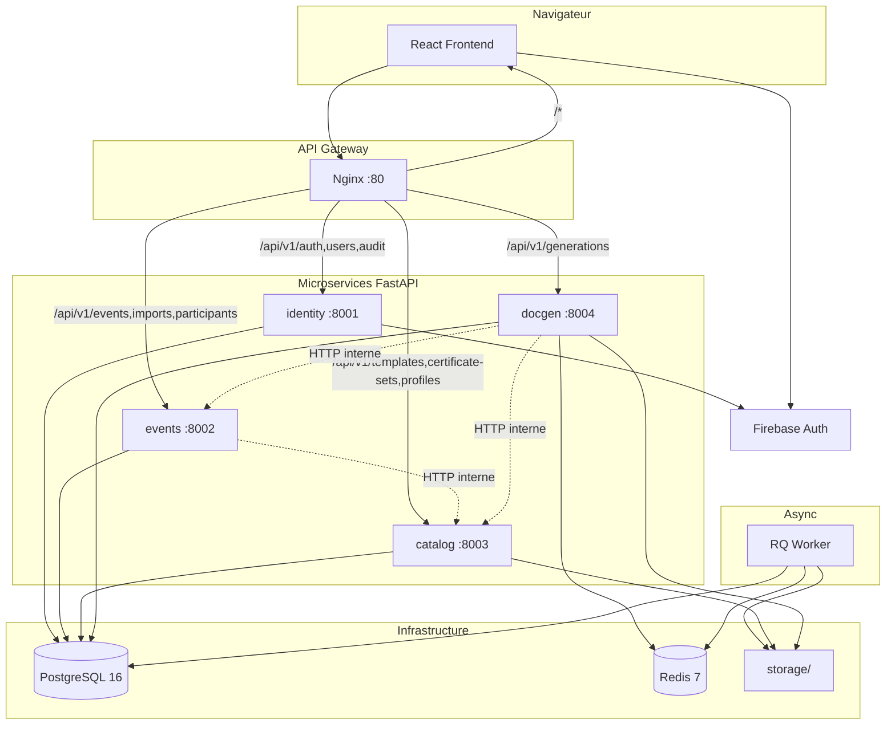
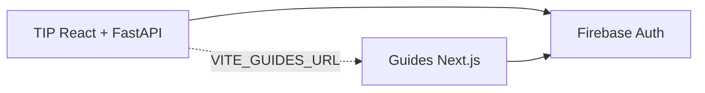
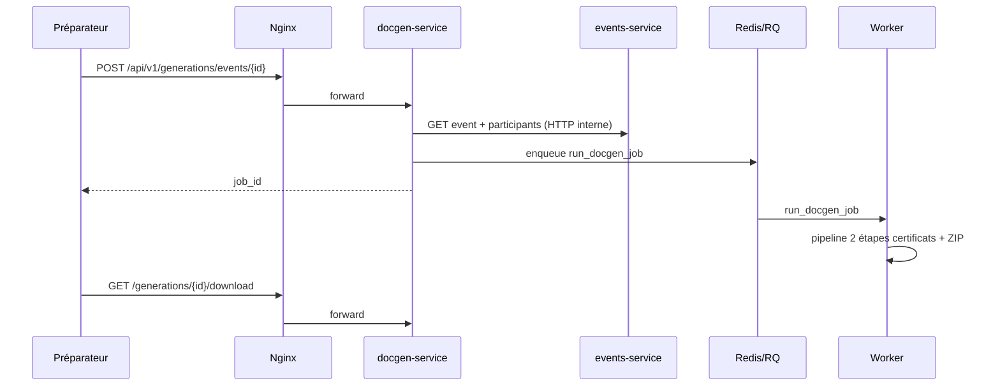

# Architecture — Traumatec Impact Platform

## Vue d'ensemble (microservices)



## Écosystème Traumatec (hors repo)

**Guides procédures** = application **Next.js séparée** (autre dépôt, autre stack). Intégration avec TIP via **Firebase SSO** + lien URL — pas via un microservice Python.



Détails : [ecosystem.md](ecosystem.md) · [ADR-009](decisions/009-external-apps-nextjs-guides.md)

## Isolation des données (schémas PostgreSQL)

| Schéma | Service | Tables |
|--------|---------|--------|
| `identity` | identity | users, audit_logs |
| `catalog` | catalog | package_templates, certificate_*, event_profiles, system_settings |
| `events` | events | annual_imports, events, participants, event_attachments |
| `docgen` | docgen | generation_jobs |

Les clés étrangères cross-schéma (ex. `events.events.certificate_set_id → catalog.*`) restent valides dans une instance PostgreSQL unique. Une migration future vers des bases séparées remplacera ces FK par des appels API.

## Routage API Gateway

| Préfixe URL | Service |
|-------------|---------|
| `/api/v1/auth`, `/users`, `/audit` | identity |
| `/api/v1/events`, `/imports`, `/participants` | events |
| `/api/v1/templates`, `/certificate-sets`, `/profiles` | catalog |
| `/api/v1/generations` | docgen |

Le frontend n'appelle **jamais** les ports 8001–8004 directement en production : tout passe par Nginx (`:8080`).

## Package partagé `tip-common`

```
packages/tip-common/tip_common/
├── app_factory.py    # create_service_app()
├── config.py         # BaseServiceSettings + URLs inter-services
├── security.py       # Firebase JWT, rôles
├── contracts.py      # Contrats Pydantic inter-modules
└── database.py       # SQLAlchemy helpers
```

## Étendre le système

| Besoin | Approche |
|--------|----------|
| Nouvelle brique **backend TIP** (Python) | `services/_template/` → [services/README.md](../services/README.md) |
| Nouveau **produit Traumatec** (ex. Guides) | **Autre dépôt**, stack libre (Next.js) → [ecosystem.md](ecosystem.md) |

Ne pas greffer Next.js dans le `docker-compose.yml` TIP.

## Pipeline DocGen



## Décisions documentées

- [ADR-009 — Apps externes Next.js (Guides)](decisions/009-external-apps-nextjs-guides.md)
- [Écosystème Traumatec](ecosystem.md)

## Hors périmètre TIP

- Workflow validation in-app
- Module contrôle conformité automatisé
