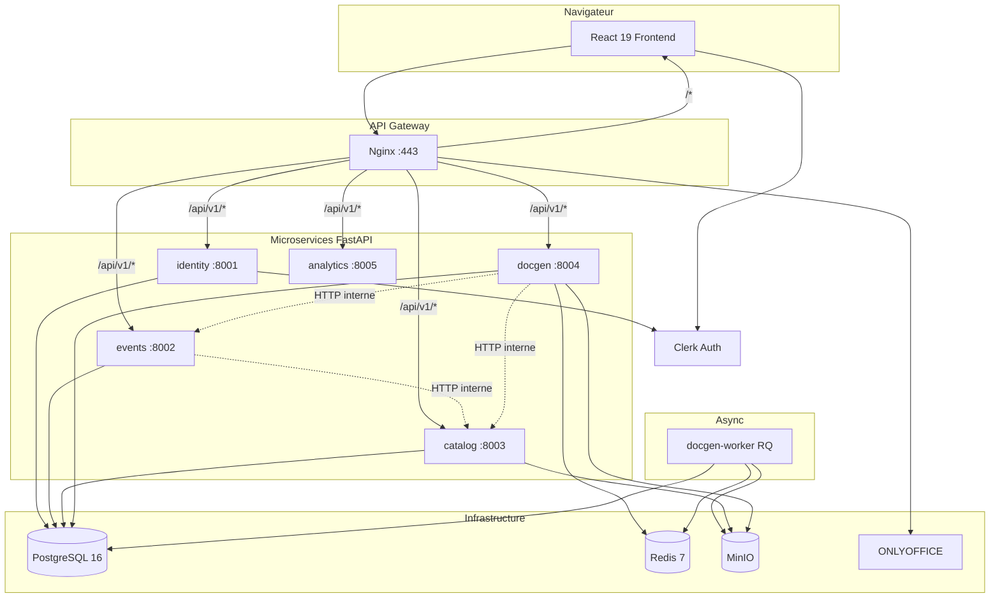
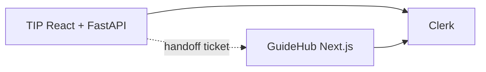
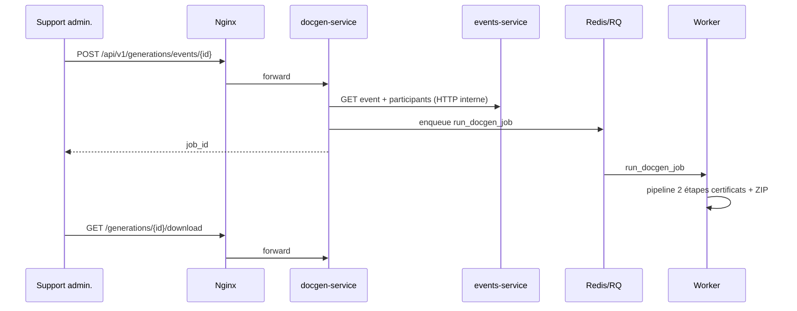

# Architecture — Traumatec Impact Platform

> **Document de synthèse.** Pour les livrables complets :
> - **[L-02 Cahier d'analyse](CAHIER_D_ANALYSE.md)** — UML analyse (cas d'utilisation, classes, séquences système) — PNG : `diagrams/analyse/`
> - **[L-03 Cahier de conception](CAHIER_DE_CONCEPTION.md)** — composants, classes de conception, déploiement, maquettes — PNG : `diagrams/conception/`
> - **[L-01 Cahier des charges](CAHIER_DES_CHARGES.md)** — besoins métier
> - **[Index diagrammes](diagrams/README.md)** — sources PlantUML et régénération PNG

## Vue d'ensemble (microservices)



## Écosystème Traumatec

**Guides procédures (GuideHub)** = application **Next.js séparée** (`guidehub.hopto.org`). Intégration avec TIP via **pont JWT / handoff Clerk** — pas via un microservice Python embarqué.



Détails : [ecosystem.md](ecosystem.md) · [ADR-009](decisions/009-external-apps-nextjs-guides.md) · [ADR-010](decisions/010-clerk-auth-closed-app.md)

## Isolation des données (schémas PostgreSQL)

| Schéma | Service | Tables principales |
|--------|---------|-------------------|
| `identity` | identity | utilisateurs, user_roles, audit_logs, notifications |
| `events` | events | annual_imports, events, participants, teachers, national_contacts |
| `catalog` | catalog | package_templates, package_bundles, package_activity_categories, certificate_* |
| `docgen` | docgen | generation_jobs, package_workflow_steps, package_file_reviews |

Les clés étrangères cross-schéma restent valides dans une instance PostgreSQL unique (ADR-008).

## Routage API Gateway

| Préfixe URL | Service |
|-------------|---------|
| `/api/v1/auth`, `/users`, `/audit`, `/guides`, `/notifications` | identity |
| `/api/v1/events`, `/imports`, `/participants`, `/teachers`, `/assistant` | events |
| `/api/v1/templates`, `/certificate-sets`, `/packages`, `/profiles` | catalog |
| `/api/v1/generations`, `/workflow`, `/certificates` | docgen |
| `/api/v1/analytics` | analytics |

Le frontend n'appelle **jamais** les ports 8001–8005 en production : tout passe par Nginx.

## Package partagé `tip-common`

```
packages/tip-common/tip_common/
├── app_factory.py    # create_service_app()
├── config.py         # BaseServiceSettings + URLs inter-services
├── security.py       # Clerk JWT (JWKS), rôles
├── contracts.py      # Contrats Pydantic inter-modules
└── database.py       # SQLAlchemy helpers
```

## Pipeline DocGen



## Workflow qualité (in-app)

États : `generated` → `submitted` → `under_procedure_review` → `procedure_approved` → `under_final_validation` → `approved`

Voir [REFACTOR_RBAC_WORKFLOW.md](REFACTOR_RBAC_WORKFLOW.md) et [CAHIER_DE_CONCEPTION.md](CAHIER_DE_CONCEPTION.md) §8.

## Décisions documentées

- [ADR-008 — Microservices modulaires](decisions/008-microservices-modular-architecture.md)
- [ADR-010 — Clerk auth](decisions/010-clerk-auth-closed-app.md)
- [ADR-007 — Certificats 2 passes](decisions/007-certificate-two-step-pipeline.md)
- [Écosystème Traumatec](ecosystem.md)

## Étendre le système

| Besoin | Approche |
|--------|----------|
| Nouvelle brique **backend TIP** (Python) | `services/_template/` → [services/README.md](../services/README.md) |
| Nouveau **produit Traumatec** (ex. Guides) | **Autre dépôt**, stack libre (Next.js) → [ecosystem.md](ecosystem.md) |

Ne pas greffer Next.js dans le `docker-compose.yml` TIP.
