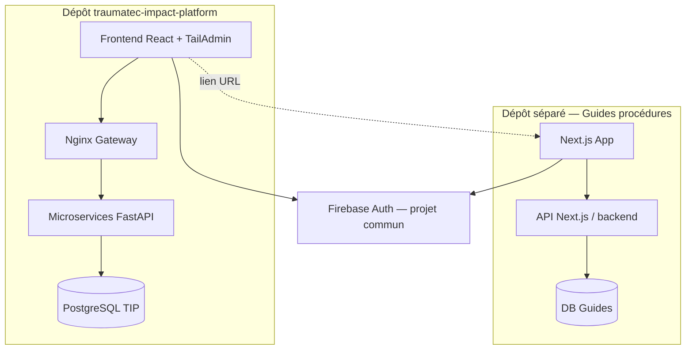

# Écosystème Traumatec

TIP n'est qu'un composant de l'écosystème. D'autres produits coexistent avec **leur propre stack** et **leur propre dépôt**.

## Cartographie



| Produit | Dépôt | Stack | Rôle |
|---------|-------|-------|------|
| **TIP** (AOA-DocGen) | `traumatec-impact-platform` | React, FastAPI, PostgreSQL | Paquets documentaires, Processing Team |
| **Guides procédures** | *autre repo* | **Next.js**, stack propre | Procédures métier, templates consultables |

## Intégration TIP ↔ Guides

| Mécanisme | Périmètre actuel | Évolution |
|-----------|------------------|-----------|
| SSO Firebase | Même projet Firebase, JWT partagé | Config SSO Guides (hors S1–S4 TIP) |
| Lien UI | Bouton « Voir la procédure » → URL externe | Contextuel par type d'événement |
| API commune | **Non** — pas d'appels REST obligatoires | Optionnel : deep-link avec `?theme=iec` |
| Base de données | **Séparées** | — |

## Deux façons d'étendre l'écosystème

### 1. Module backend TIP (Python)

Pour étendre **DocGen / événements / admin** dans ce produit :

→ Copier `services/_template/` — voir [services/README.md](../services/README.md)

### 2. Nouvelle application Traumatec (autre langage)

Pour un produit autonome comme **Guides (Next.js)** :

- Créer un **nouveau dépôt**
- Réutiliser **Firebase Auth** (même `projectId`)
- Exposer une URL dédiée ; TIP ne proxy pas l'API Guides
- Documenter le lien dans TIP via `VITE_GUIDES_URL`

Voir [ADR-009](decisions/009-external-apps-nextjs-guides.md).

## Configuration TIP (lien Guides)

```env
# .env — optionnel, Sprint ultérieur
VITE_GUIDES_URL=https://guides.traumatec.org
```

Dans le frontend TIP, un lien simple suffit en V1 :

```tsx
<a href={import.meta.env.VITE_GUIDES_URL} target="_blank" rel="noopener">
  Guides procédures
</a>
```

Pas de greffage Next.js dans le `docker-compose.yml` TIP.
