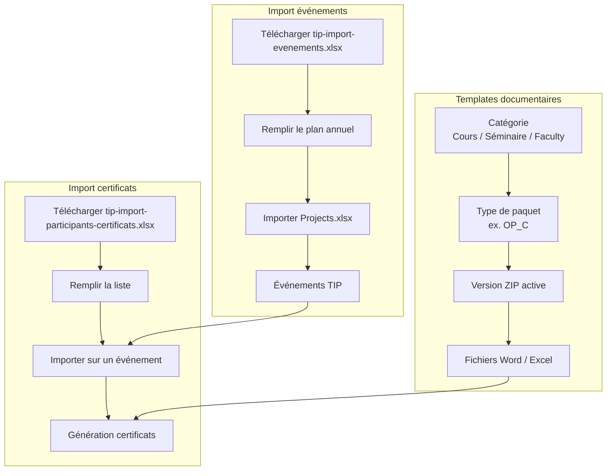

# Parcours d'import TIP

## Vue d'ensemble

## 1. Catégories et types de templates

| Niveau | Exemple | Gestion |
|--------|---------|---------|
| Catégorie (activity kind) | Cours, Séminaire, Faculty | Fixe (3 onglets) |
| Type de paquet | Op C → `OP_C` | Système + types ajoutés par l'admin |
| Version ZIP | v1, v2… | Upload admin sur `/documents/templates` |

**Admin** : section « Catégories et types de paquets » → ajouter un code, libellé, titre, durée.

## 2. Modèle import événements

- **Fichier** : `tip-import-evenements.xlsx`
- **Endpoint** : `GET /api/v1/imports/annual-plan/template`
- **Import** : `POST /api/v1/imports/annual-plan`
- **UI** : Événements → Importer le plan annuel → « Modèle import événements »

Colonnes principales : Title, Activity, Project number, Start date, End date, Location, Country…

## 3. Modèle import participants (certificats)

- **Fichier** : `tip-import-participants-certificats.xlsx`
- **Endpoint** : `GET /api/v1/participants/import-template`
- **Import** : `POST /api/v1/participants/events/{event_id}/import`
- **UI** : Certificats → sélectionner un événement → « Modèle import participants »

Colonnes : Nom, prenom, Statut, Nom_evenement, Formation_sanitaire, Email, telephone, specialite…

## 4. Enchaînement recommandé

1. Configurer les types de paquets et importer les ZIP templates.
2. Importer le plan annuel (événements).
3. Sur chaque événement : importer les participants depuis l'export inscription.
4. Générer les certificats (docgen).
