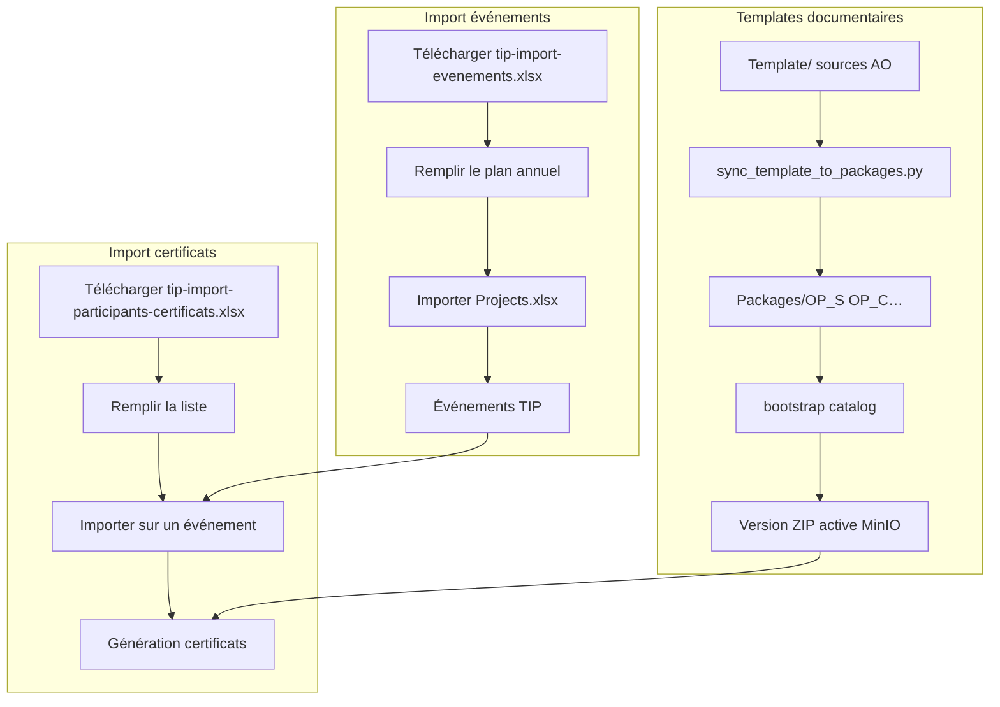

# Parcours d'import TIP

## Vue d'ensemble



## 0. Déploiement templates (local / EC2)

```bash
# Migrations SQL
bash scripts/apply_all_migrations.sh

# Sync Template/ → Packages/ + import catalog
bash scripts/deploy_templates.sh
```

Sources : `Template/Paquet_Cours/` et `Template/Paquet_Sem/` → codes `OP_C`, `ORP_C`, `NONOP_C`, `OP_S`, `PBO_S`, `IEC_S`, `FET`.

## 1. Catégories et types de templates

| Niveau | Exemple | Gestion |
|--------|---------|---------|
| Catégorie (activity kind) | Cours, Séminaire, Faculty | Fixe (3 onglets) |
| Type de paquet | Op C → `OP_C` | Système + types ajoutés par l'admin |
| Version ZIP | v1, v2… | Bootstrap / upload admin sur `/documents/templates` |

**Admin** : section « Catégories et types de paquets » → ajouter un code, libellé, titre, durée.

## 2. Modèle import événements

- **Fichier** : `tip-import-evenements.xlsx` (mise en forme TIP, compatible Projects.xlsx)
- **Endpoint** : `GET /api/v1/imports/annual-plan/template`
- **Import** : `POST /api/v1/imports/annual-plan`
- **UI** : Événements → Importer Projects.xlsx → « Modèle import événements »
- **Fichier réel** : `Projects.xlsx` à la racine du dépôt (export AID Impact)

Colonnes : Title, Activity, Project number, Start date, End date, Status, Responsible person, Organizer…, Location, Country, Region, Cost center, Participants, Amount (CHF)…

## 3. Modèle import participants (certificats)

- **Fichier** : `tip-import-participants-certificats.xlsx` (mise en forme TIP + feuille Aide)
- **Endpoint** : `GET /api/v1/participants/import-template`
- **Import** : `POST /api/v1/participants/events/{event_id}/import`
- **UI** : Certificats → sélectionner un événement → « Modèle import participants »

Colonnes : Nom, prenom, Statut, Nom_evenement, Formation_sanitaire, Email, telephone, specialite…

## 4. Enchaînement recommandé

1. Appliquer les migrations + synchroniser / bootstrapper les ZIP templates.
2. Importer le plan annuel (`Projects.xlsx` ou modèle TIP).
3. Sur chaque événement : importer les participants.
4. Générer les certificats (docgen).
